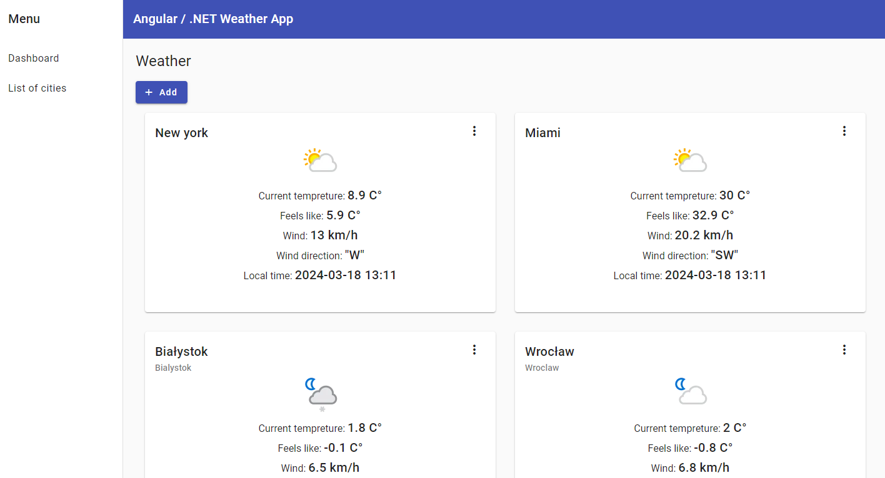
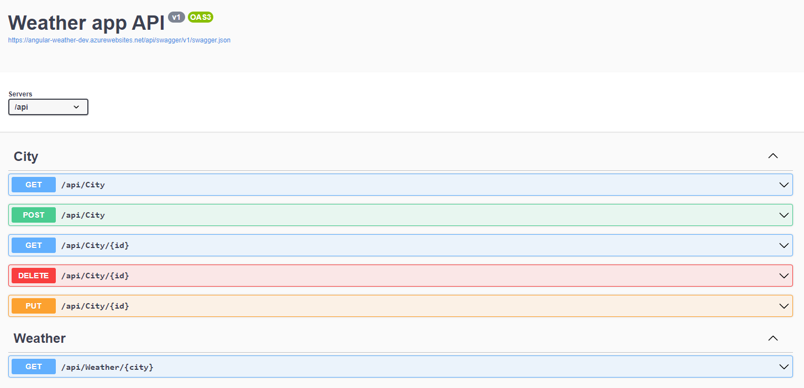

# Spis Treści

1. [Aplikacja Pogodowa Angular / .NET](#aplikacja-pogodowa-angular--net)
2. [Funkcje](#funkcje)
3. [Użyte Technologie](#użyte-technologie)
4. [Swagger API](#swagger-api)
5. [City Controller](#city-controller)
6. [Weather Controller](#weather-controller)

---

# Aplikacja Pogodowa Angular / .NET

To jest aplikacja pogodowa zbudowana przy użyciu Angulara dla frontendu oraz .NET dla backendu. Umożliwia użytkownikom zarządzanie miastami (dodawanie, usuwanie, edytowanie), które są przechowywane w bazie danych. Dodatkowo, użytkownicy mogą przeglądać aktualną pogodę dla określonych miast, pobieraną z zewnętrznego API.



## Funkcje

- **Zarządzanie Miastami:** Użytkownicy mogą dodawać, usuwać i edytować miasta. Zmiany te są odzwierciedlane w bazie danych.
- **Wyświetlanie Pogody:** Użytkownicy mogą przeglądać aktualną pogodę dla określonych miast, pobieraną z zewnętrznego API.
- **Responsywny Design:** Aplikacja została zaprojektowana tak, aby działać płynnie na różnych urządzeniach i rozmiarach ekranu.

## Użyte Technologie

- **Frontend:** Angular
- **Backend:** .NET
- **Baza Danych:** MS SQL
- **Zewnętrzne API:** [WeatherAPI](https://www.weatherapi.com/)

## Swagger API

Poniżej znajduje się screenshot prezentujący widok Swaggera, który dokumentuje dostępne endpointy API w aplikacji:



## City Controller

- **GET /api/City**
  - **Opis:** Zwraca listę wszystkich miast zapisanych w bazie danych.
  - **Parametry:** Brak.
  - **Przykładowy żądanie:** `GET /api/City`
  - **Przykładowa odpowiedź:**
    ```json
    [
        {
            "id": 1,
            "name": "City1",
            "alias": "C1"
        },
        {
            "id": 2,
            "name": "City2",
            "alias": "C2"
        }
    ]
    ```
- **GET /api/City/{id}**
  - **Opis:** Zwraca szczegółowe informacje o konkretnym mieście na podstawie jego identyfikatora.
  - **Parametry:**
    - `id` (int) - Identyfikator miasta.
  - **Przykładowy żądanie:** `GET /api/City/1`
  - **Przykładowa odpowiedź:**
    ```json
    {
        "id": 1,
        "name": "City1",
        "alias": "C1"
    }
    ```
- **POST /api/City**
  - **Opis:** Dodaje nowe miasto do bazy danych na podstawie danych przesłanych w ciele żądania.
  - **Parametry:**
    - Ciało żądania powinno zawierać dane miasta w formacie JSON.
  - **Przykładowy żądanie:**
    ```json
    {
        "name": "NewCity",
        "alias": "NC"
    }
    ```
  - **Przykładowa odpowiedź:**
    ```json
    {
        "id": 3,
        "name": "NewCity",
        "alias": "NC"
    }
    ```
- **DELETE /api/City/{id}**
  - **Opis:** Usuwa miasto o określonym identyfikatorze z bazy danych.
  - **Parametry:**
    - `id` (int) - Identyfikator miasta.
  - **Przykładowy żądanie:** `DELETE /api/City/1`
  - **Odpowiedź:** Pusty ciało odpowiedzi z kodem statusu `204 No Content`.
- **PUT /api/City/{id}**
  - **Opis:** Aktualizuje informacje o mieście o określonym identyfikatorze na podstawie danych przesłanych w ciele żądania.
  - **Parametry:**
    - `id` (int) - Identyfikator miasta.
    - Ciało żądania powinno zawierać zaktualizowane dane miasta w formacie JSON.
  - **Przykładowy żądanie:**
    ```json
    {
        "name": "UpdatedCity",
        "alias": "UC"
    }
    ```
  - **Przykładowa odpowiedź:**
    ```json
    {
        "id": 1,
        "name": "UpdatedCity",
        "alias": "UC"
    }
    ```

## Weather Controller

- **GET /api/weather/{city}**
  - **Opis:** Zwraca informacje o aktualnej pogodzie dla określonego miasta.
  - **Parametry:**
    - `city` (string) - Nazwa miasta, dla którego chcemy uzyskać informacje o pogodzie.
  - **Przykładowy żądanie:** `GET /api/weather/Warsaw`
  - **Przykładowa odpowiedź:**
    ```json
    {
        "location": {
            "name": "Warsaw",
            "region": "",
            "country": "Poland",
            "lat": 52.25,
            "lon": 21,
            "tz_id": "Europe/Warsaw",
            "localtime_epoch": 1710781889,
            "localtime": "2024-03-18 18:11"
        },
        "current": {
            "temp_c": 2,
            "is_day": 0,
            "condition": {
                "text": "Moderate rain",
                "icon": "//cdn.weatherapi.com/weather/64x64/night/302.png",
                "code": 1189
            },
            "wind_mph": 6.9,
            "wind_kph": 11.2,
            "wind_dir": "NW",
            "cloud": 75,
            "feelslike_c": -1.2
        }
    }
    ```
